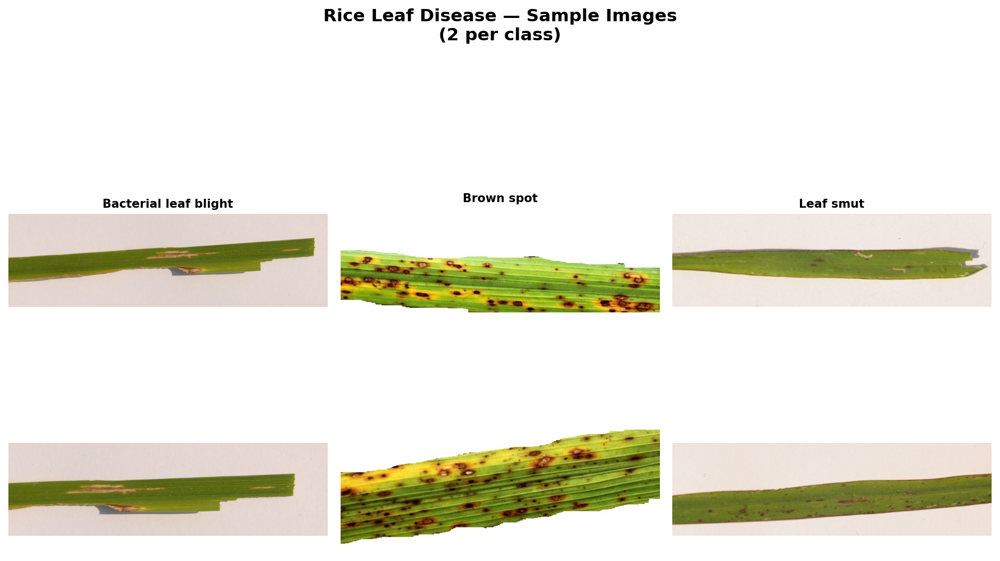
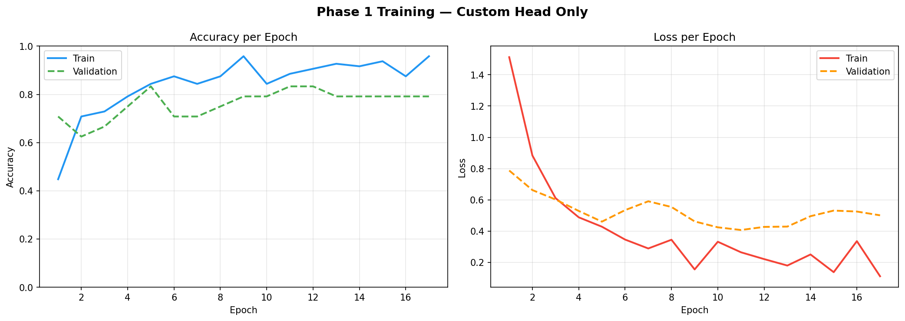
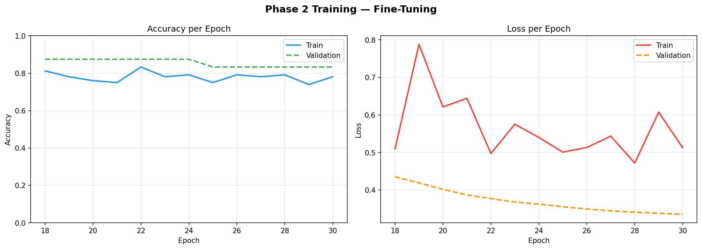
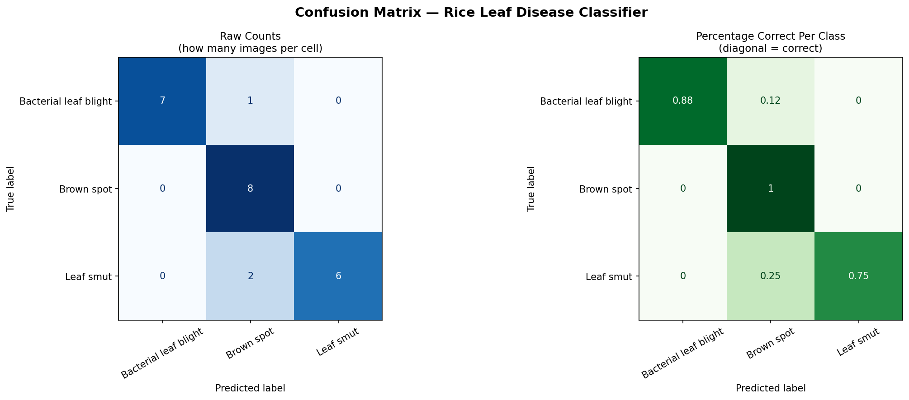
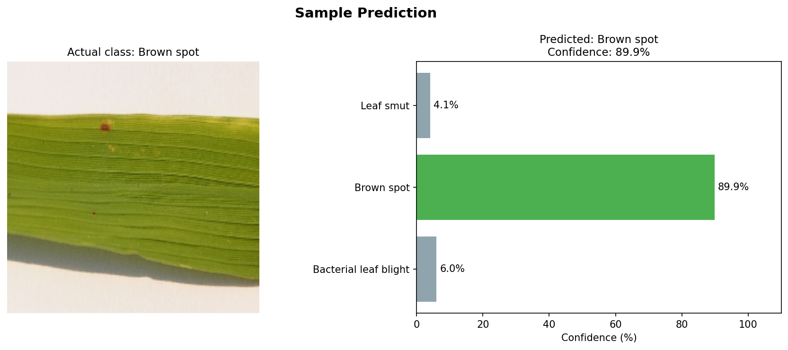
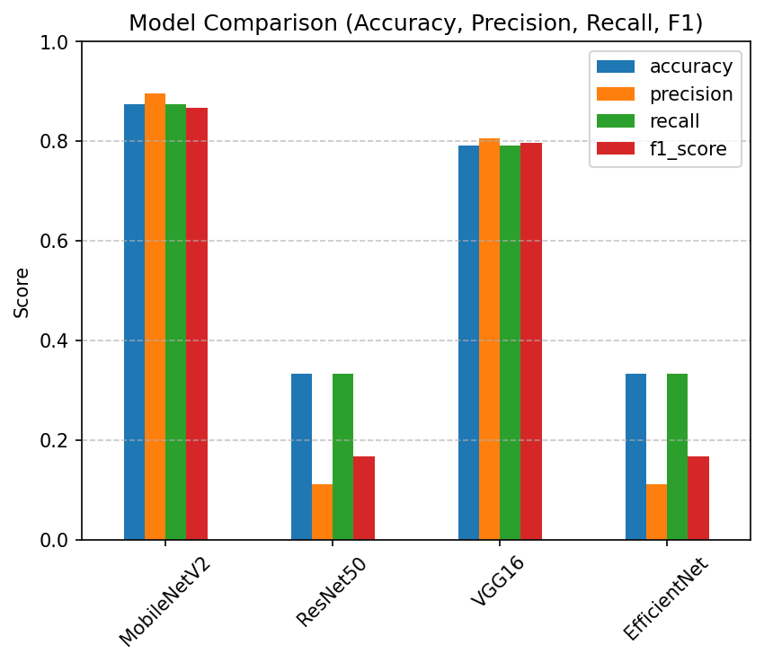

# 🌾 Rice Leaf Disease Classifier (Deep Learning)

A deep learning-based image classification system that detects rice leaf diseases using transfer learning with MobileNetV2.

---

## 🚀 Project Overview

This project builds an intelligent model to classify different rice leaf diseases from images.
It uses **Transfer Learning** with a pre-trained CNN to achieve high accuracy even with limited data.

---

## Models Used
The following pre-trained CNN models are implemented and compared:

MobileNetV2
EfficientNet (B0/B1)
ResNet50
VGG16

---

## 📊 Features

* Automatic dataset scanning and class detection
* Data augmentation (rotation, zoom, brightness, flipping)
* Two-phase training:

  * Phase 1: Train custom layers
  * Phase 2: Fine-tune top layers
* Performance evaluation:

  * Accuracy & Loss curves
  * Confusion Matrix
  * Classification Report
* Sample prediction visualization
* Automatic saving of all results

---

## 📁 Project Structure

```
rice_leaf_disease/
│
├── rice_leaf.py
├── class_names.json
├── README.md
├── .gitignore
│
└── results/
    ├── 01_sample_images.png
    ├── 02_training_curves_phase1.png
    ├── 03_training_curves_phase2.png
    ├── 04_confusion_matrix.png
    ├── 05_sample_prediction.png
    ├── classification_report.txt
    └── model_comparison.txt
```

---

## 📸 Results

### Sample Images



### Training Curves




### Confusion Matrix



### Sample Prediction




### Final Model Comparison



---

## ⚙️ Installation & Setup

### 1. Clone the repository

```bash
git clone https://github.com/divyanshi0226/rice_leaf_disease-deep-learning-.git
cd rice_leaf_disease-deep-learning-
```

### 2. Install dependencies

```bash
pip install tensorflow numpy matplotlib seaborn pillow scikit-learn
```

### 3. Set dataset path

Update this in `rice_leaf.py`:

```python
DATA_DIR = "your_dataset_path_here"
```

Dataset structure:

```
dataset/
├── Brown_Spot/
├── Leaf_Blast/
├── Healthy/
```

---

## ▶️ Run the Project

```bash
python rice_leaf.py
```

---

## 📈 Sample Output

```
Prediction: Brown spot (confidence: ~90%)
Actual    : Brown spot
```

---

## 🧪 Model Comparison

# The models are compared based on:

* Accuracy
* Precision
* Recall
* F1-score
* Confusion Matrix

# Example Comparison Table

            Accuracy Precision Recall F1_score
MobileNetV2  0.875   0.8889   0.875   0.8739
ResNet50,    0.1667  0.1528   0.1667  0.1508
VGG16        0.8333  0.8615   0.8333  0.8331
EfficientNet 0.3333  0.1111   0.3333  0.1667

---

## Best Performing Model

After comparing all models, the best performing model is:
⭐ MobileNetV2
Why it performed best:
* Highest accuracy among all models
* Better generalization on unseen data
* Lower overfitting compared to VGG16 and ResNet50
* More efficient (fewer parameters with better performance)

## Key Parameters

* Transfer Learning improves performance on small datasets
* Fine-tuning boosts accuracy significantly
* Data augmentation helps prevent overfitting
* Visualization helps understand model performance

---

## 🚀 Future Improvements

* Deploy as a web app (React + Node.js)
* Build a mobile app for farmers
* Add voice-based prediction system
* Integrate with cloud AI services

---

## 👩‍💻 Author

**Divyanshi**

---

## ⭐ Support

If you like this project, give it a ⭐ on GitHub!

